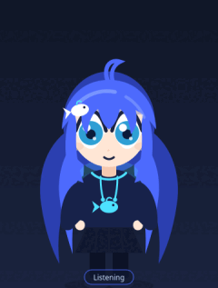
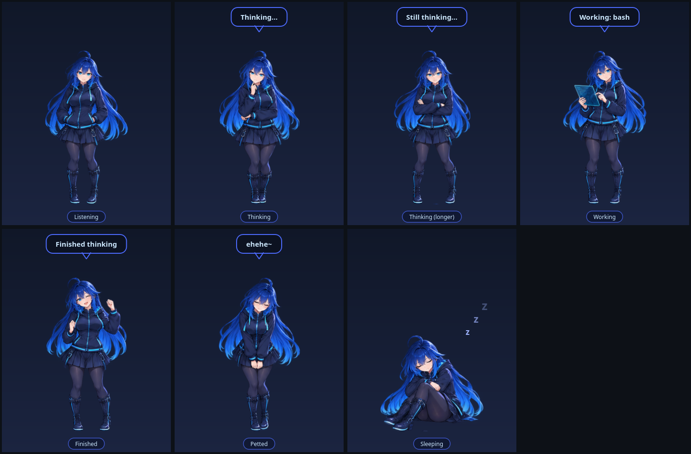

# DeepSeek-chan

**A little company for your next big think.**

An anime-girl desktop pet that reacts to your opencode TUI sessions, built with Python and PyQt6.



## Features

- Reactions for thinking, deep thinking, tool work, completion, and errors.
- Grab her by the scruff: she dangles, and a fast drag flings her with real
  spring-damped momentum before she swings back to centre.
- Pat, flick, summon, wake, and sleep events; hoodie and hoodie-up outfits.
- Follows you across workspaces (bspwm sticky) and hides over fullscreen video.
- Configurable SVG palette, timing, scale, and placement.
- A JavaScript opencode bridge and a display-free Python state machine.
- A sprite-sheet slicer and PNG renderer with missing-pose fallbacks.
- Headless diagnostics, three alternate SVG palettes, and tested event transport.



The demo and state images are rendered offscreen from the bundled artwork.

## Install

From a checkout of this repository, with Python 3.9+ and pipx installed:

```sh
pipx install .
deepseek-chan install-plugin
deepseek-chan run
```

Restart opencode after installing the plugin. Use `deepseek-chan install-plugin --project`
for installation into the current project's `.opencode/plugins/` directory.
A graphical desktop is needed for the pet; window placement, transparency, and
input behavior depend on your window manager and compositor.

```sh
deepseek-chan run --demo
deepseek-chan run --pat
deepseek-chan run --summon
deepseek-chan outfit hoodie_up
```

## Configuration

Run `deepseek-chan config` to create the example configuration and
`deepseek-chan paths` to locate it. Or save this as `my-pet.toml` and launch
`deepseek-chan run --config my-pet.toml`:

```toml
scale = 0.9
always_on_top = true
click_through = true
start_position = "bottom-right"
outfit = "hoodie"
follow_desktops = true

[palette]
hair = "#4D6BFE"
hair_shadow = "#2B3FB0"
hair_shine = "#8FA8FF"
hoodie_trim = "#4DE1FF"

[timing]
sleep_after = 120.0
hard_thinking_after = 60.0
stale_after = 90.0
finished_bubble_for = 5.0

[quips]
finished = ["All done!", "Nailed it~"]
```

Idle sleep and stale-session fallback take priority over deep thinking. Choose
thresholds accordingly, or keep sending session activity while work continues.
A `[quips]` table replaces the existing quip dictionary; omit it to keep all defaults.

## Artwork and sprite packs

The pet ships with a bundled PNG character pack (16 poses) and uses it by default.
Point `sprite_pack` at your own sliced directory to override it; the SVG renderer
remains as a fallback when no pack is present. See
[sprite preparation](docs/sprite-sheets.md) for the canonical 16-cell layout and
CLI usage, and [PNG sprite packs](docs/raster-packs.md) for replacement details.

See [CONTRIBUTING.md](CONTRIBUTING.md) for headless checks and contribution guidelines.

## Linux compositors (picom)

A transparent overlay can be blurred, shadowed or rounded by the compositor,
which shows up as a hazy silhouette. Exclude the pet's window class from those
effects, for example:

```conf
blur-background-exclude = [ "class_g = 'deepseek-chan'" ];
shadow-exclude         = [ "class_g = 'deepseek-chan'" ];
fade-exclude           = [ "class_g = 'deepseek-chan'" ];
rounded-corners-exclude = [ "class_g = 'deepseek-chan'" ];
```

On bspwm the pet floats, stays on the above layer, spans every desktop (sticky)
and hides over fullscreen by changing opacity rather than unmapping.

## Credits and license

Project by MrAxololtol and contributors. Built with PyQt6/Qt, platformdirs,
and tomli on Python versions that need it; connected to opencode via its plugin bridge.
Project source and contributed tooling are MIT-licensed; see [LICENSE](LICENSE).
Dependencies retain their own licenses. Only contribute artwork you own or have
permission to redistribute with documented licensing. No reference video is included.

DeepSeek-chan is an **unofficial fan project**, not affiliated with, endorsed by,
or sponsored by DeepSeek. Names and marks belong to their respective owners.

## Diagnostics and alternate palettes

```sh
deepseek-chan doctor
deepseek-chan doctor --json
```

The doctor checks Qt imports, the window-mask API, SVG layers or PNG poses, the plugin
installation, and cache writability. It creates no GUI application. A compositor
result marked `CHECK` is expected when run outside the pet process: actual desktop
support cannot be proved headlessly. Use `--assets`, `--plugin-dir`, `--cache-dir`,
and `--project-dir` to inspect specific locations. Exit 1 means at least one check
failed or needs manual verification.

Three palette presets are included: `aurora`, `lavender`, and `ember`. From a
checkout, try one with:

```sh
deepseek-chan run --config src/deepseek_chan/themes/aurora.toml
```

Alternatively copy a preset's `[palette]` table into your user configuration.
These palettes recolor SVG layers; generated PNG artwork has baked-in colors.
